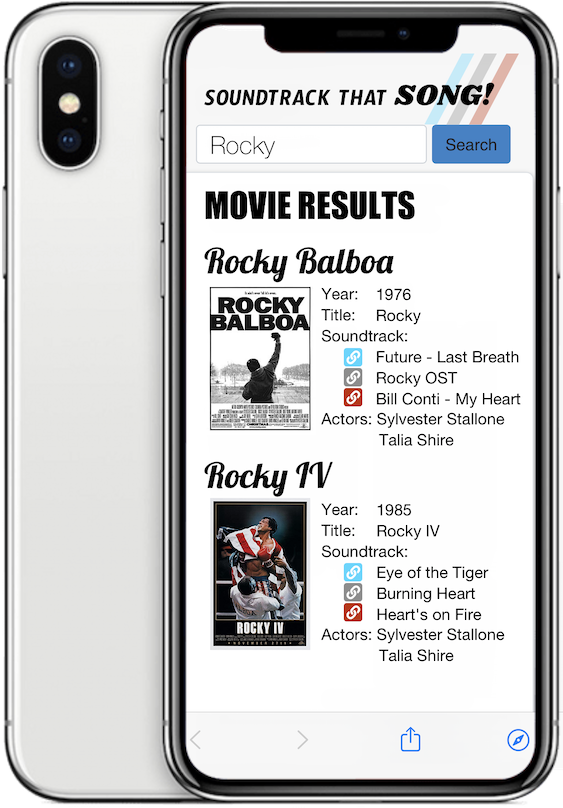

# Sountrack That Movie

## About
-This web app is designed to find the soundtrack to any TV or movie that you search for. Listen to the top 3 search results.

-We planned, designed, programmed, and published this within a week for a school project by a team of four.

## Technologies Used
* BootStrap
* JavaScript
* CSS3
* HTML5
* jQuery
* OMDB API
* Youtube API

## Developer Team
**FRONTEND - html / css**

* Trion Bailey = https://github.com/trionb
* Toni Lomax = https://github.com/tlomax111

**BACKEND - javascript / ajax**

* Edwin Genova = https://github.com/novaaaax
* Walt Ribeiro = https://github.com/waltribeiro

## Licenses

OMDB API by Brian Fritz. Licensed under CC BY-NC 4.0.

## Screenshot

